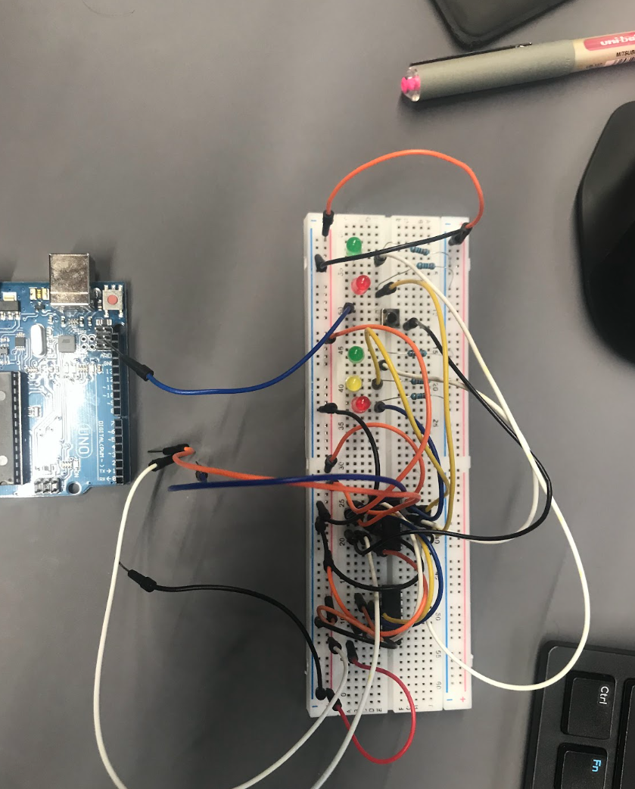
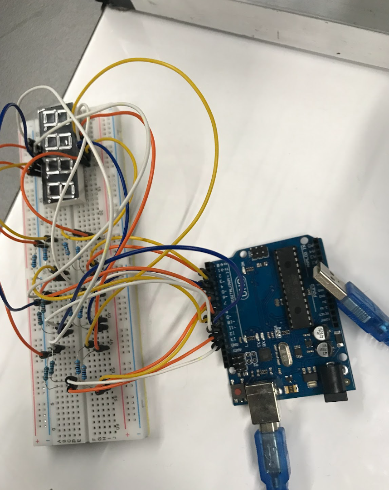

# Adaptive Traffic Light Control System

A real-time embedded systems project built in Python, controlling physical traffic light hardware via an Arduino UNO. Designed and developed as part of my Robotics and Mechatronics Engineering studies at Monash University.

---

## Hardware

| Traffic Light Board | Countdown Display Board |
|---|---|
|  |  |

The left board holds the Red, Yellow, and Green LEDs along with the pedestrian push button. The right board holds the 4-digit 7-segment display that shows the countdown timer for each phase.

---

## Overview

This project implements a fully functional traffic light controller that runs on physical hardware. Python communicates with the Arduino UNO over USB using the Firmata protocol, giving direct control over all GPIO pins from a high-level software layer.

The system manages a complete traffic light sequence, a 4-digit countdown timer on a 7-segment LED display, and a pedestrian crossing request button. An adaptive timing agent adjusts phase durations based on time-of-day traffic density modelling, reflecting how real traffic management systems like VicRoads SCATS operate.

---

## Key Features

- Real-time hardware control via Python and the pyfirmata2 serial communication protocol
- Finite state machine managing six traffic phases: Green, Amber, All-Red clearance, Red, Pedestrian Walk, and Pedestrian Flash
- Adaptive AI agent that calculates green and red phase durations based on simulated traffic density, modelled on Melbourne peak-hour patterns
- 4-digit 7-segment LED display with multiplexed refresh at 125Hz for real-time countdown visibility
- Multi-threaded architecture with dedicated threads for display refresh and pedestrian button polling, decoupled from the main control loop
- Simulation mode for full software testing without physical hardware connected
- Modular tool-wrapper pattern for hardware abstraction, separating logic from physical I/O

---

## Software Stack

- Python 3
- pyfirmata2 for serial communication with Arduino over USB
- threading for concurrent display refresh and button polling
- dataclasses and enum for typed system state and configuration management

---

## Project Structure

The codebase is split across nine files. Each file has one responsibility and communicates with others through a shared context object.

```
traffic_light/
    main.py         Entry point. Wires all modules together and starts the system.
    config.py       All constants: pin mapping, timing values, display patterns.
    context.py      SystemContext dataclass and TrafficState enum.
    wrappers.py     Tool wrappers that resolve pin names to hardware objects.
    hardware.py     All pyfirmata2 calls: pin setup, LED writes, button reads.
    display.py      7-segment display multiplexing and countdown loop.
    agent.py        Adaptive timing agent based on Melbourne peak-hour rules.
    controller.py   Traffic light state machine and phase transition logic.
    button.py       Pedestrian button polling thread.
```

No file exceeds 200 lines. The largest is controller.py at 180 lines.

---

## Module Dependency Map

```
config.py       (no dependencies)
context.py      (no dependencies)
wrappers.py     --> context
hardware.py     --> config, context, wrappers
display.py      --> config, context
agent.py        --> config
controller.py   --> config, context, hardware, agent
button.py       --> context, hardware
main.py         --> all modules
```

Dependencies flow in one direction only. No circular imports.

---

## Traffic Light Sequence

```
GREEN (adaptive 20-60s) -> AMBER (4s) -> ALL RED (2s) -> RED (adaptive 20-60s)
                                                              |
                                         if button pressed -> PED WALK (15s) -> PED FLASH (5s)
                                                              |
                                                           repeat
```

The All-Red clearance phase is a deliberate design decision aligned with Australian road safety standards. It allows any vehicle that entered on a late amber signal to clear the intersection before the next phase begins.

---

## Setup and Installation

1. Upload the StandardFirmata sketch to the Arduino UNO via Arduino IDE under File, Examples, Firmata, StandardFirmata.

2. Install the Python dependency:

```bash
pip install pyfirmata2
```

3. Set your serial port in config.py:

```python
ARDUINO_PORT = "COM3"           # Windows
ARDUINO_PORT = "/dev/ttyACM0"   # Linux
ARDUINO_PORT = "/dev/cu.usbmodemXXXX"  # macOS
```

4. Update PIN_CONFIG in config.py if your wiring differs from the defaults.

5. Set SIMULATION_MODE = False in config.py to run on real hardware.

6. Run:

```bash
python main.py
```

To test without hardware, keep SIMULATION_MODE = True. The full state machine, agent logic, and countdown run in the terminal with text output.

---

## Skills Demonstrated

- Embedded systems design and hardware-software integration
- Real-time control systems and concurrent programming in Python
- Modular software architecture across multiple communicating files
- Serial communication protocol implementation via pyfirmata2
- Finite state machine design for safety-critical sequencing
- Adaptive AI agent design for dynamic timing control
- Sensor and actuator interfacing on Arduino UNO
- Applied robotics and mechatronics engineering principles

---

## Background

Built as part of my Bachelor of Engineering (Robotics and Mechatronics, AI specialisation) at Monash University, Melbourne. This project connects hardware interfacing with structured Python software design and adaptive AI control logic, areas I actively develop through both academic and personal projects.
